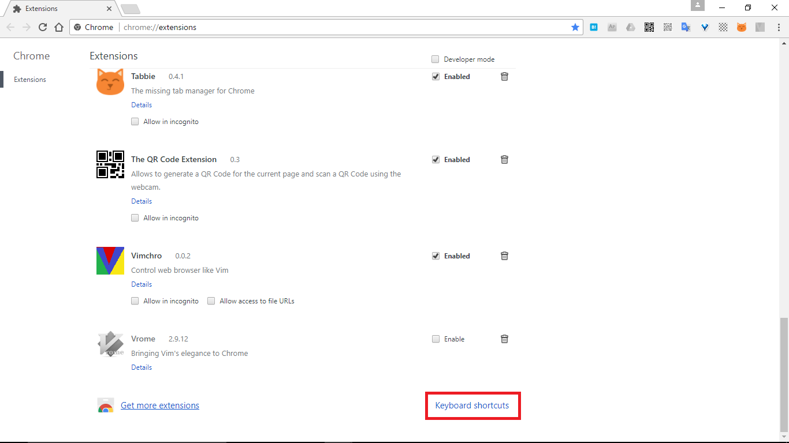
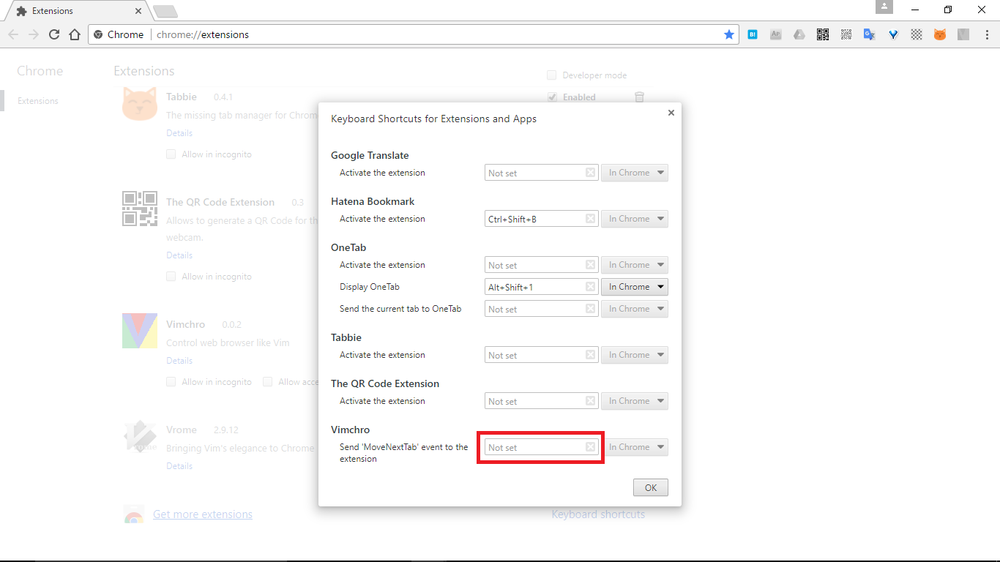
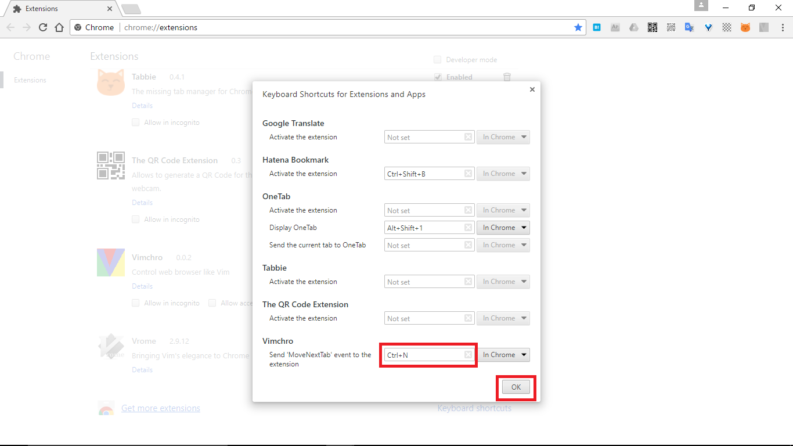

# Vimchro
This is Google Chrome extension for browsing like Vim.  
This extensions override default shortcut of Chrome.  
You can disable temporary this extensions, if you press **&lt;Shift + Esc&gt;** or **&lt;Insert&gt;** key.  
This extension is released in [Chrome Web Store](https://chrome.google.com/webstore/detail/vimchro/ldmkelbnjdchgboamnnmlpplmmbpifjh).

[日本語版の説明はこちら](./README_jp.md)

# Available key bindings
## Scroll
|Key|Action|
|---|---|
|h|Scroll to the left by 10 pixel|
|j|Scroll down by 10 pixel|
|k|Scroll up by 10 pixel|
|l|Scroll to the right by 10 pixel|
|Ctrl + d|Scroll down by half page|
|Ctrl + u|Scroll up by half page|
|Ctrl + f|Scroll down by one page|
|Ctrl + b|Scroll up by one page|
|gg|Scroll up to top of page|
|Shift + g|Scroll down to bottom of page|

## Moving browsing history
|Key|Action|
|---|---|
|&lt;Shift + h&gt; or &lt;Ctrl + o&gt;|Move backward through the browsing history|
|&lt;Shift + l&gt; or &lt;Ctrl + i&gt;|Move forward through the browsing history|

## Tab
|Key|Action|
|---|---|
|d|Close tab|
|Ctrl + p|Go to the previous (left) tab|
|Ctrl + n|Go to the next (right) tab.   To use this keybind, need setting.|

## Other
|Key|Action|
|---|---|
|r|Reload page|
|&lt;Shift + Esc&gt; or &lt;Insert&gt;|Disable temporary this extensions|

# TODO
* Disable keybind when editing text
* Add new keybinds
  * t -> open link in new tab)
  * etc (If you have any requests, please create issue)

# How to setting keybind
1. Open `Keyboard shortcuts` in [Chrome extensions setting](chrome://settings/)

2. Select `Send 'MoveNextTab' event to the extension` in Vimchro
-
3. Press Ctrl key and N key. then click `OK` button

